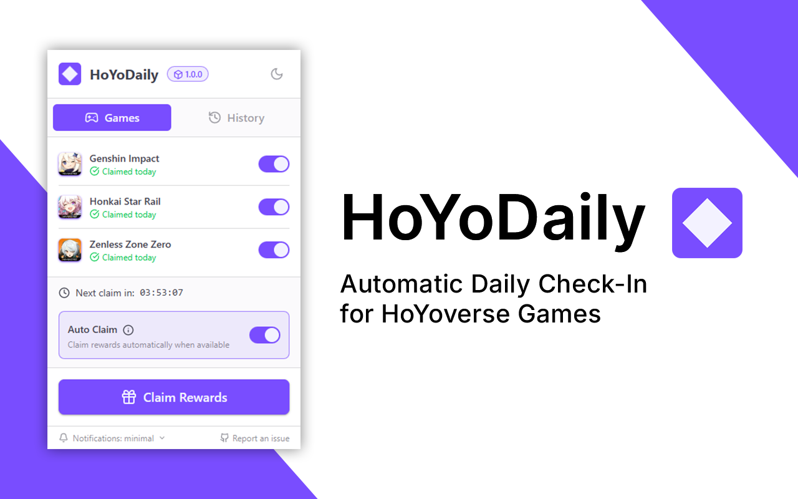
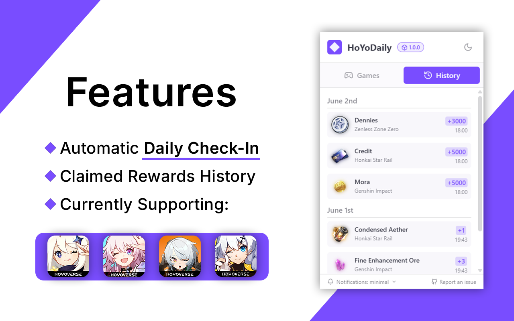

<p align="center">
  
</p>

## 📋 Overview
HoYoDaily is a browser extension that automatically claims your daily check-in rewards for HoYoverse games.
<br>
_Just set it up and forget about it! 🚀_

Currently supporting:
- Genshin Impact
- Honaki Star Rail
- Zenless Zone Zero

## 📷 Screenshots
<p float="left">
  
  
</p>

## 🌐 Supported Browsers
- Chrome
- Firefox
- Opera
- Brave
- Edge

_And probably other Chromium-based browsers, but I haven't tested_

## 📥 Installation
Download the extension from one of the following stores:
<p float="left">
  <a href="https://chromewebstore.google.com/detail/hoyodaily/ahdcannooodfmkoplicldhfccebmbbem" target="_blank">
    
  </a>
  &nbsp;
  <a href="https://addons.mozilla.org/es-ES/firefox/addon/hoyodaily_check_in/" target="_blank">
    
  </a>
</p>

## 💻 Development

### Prerequisites
- Node.js v22 or higher
- npm

### Getting Started

1. Clone the repository
   ```bash
   git clone https://github.com/Axyss/HoYoDaily.git
   cd HoYoDaily
   ```

2. Install dependencies
   ```bash
   npm install
   ```
   
3. Build the extension based on the target browser
   ```bash
   npm run build:chrome
   npm run build:firefox
   ```

4. (Optional) For hot-reload during development
   ```bash
   npm run watch
   ```

## 📄 License

This project is licensed under the [MIT license](LICENSE).

